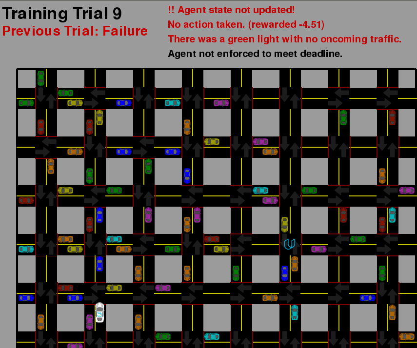
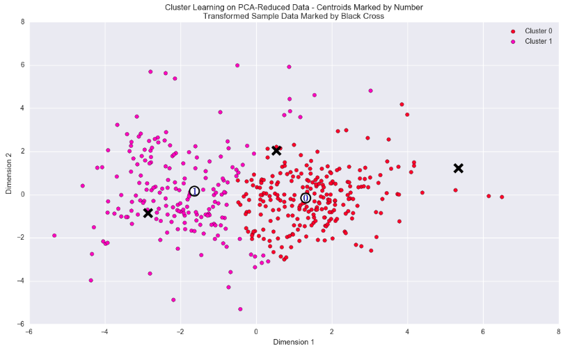
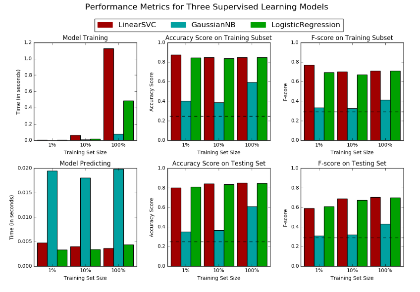

## Projects

### Predicting Stock prices using Deep learning (Apr 2017 - Apr 2017)

- **Description:**
Evaluated the performance of LSTM network to predict Google close stock price. Addressed the issue of vanishing gradient in long-term sequences using long short term memory architecture, and developed a model to predict the stock price, approximates the actual value.

- **See project** [here](https://github.com/satishjasthi/Udacity-MLNDP-Submissions/blob/master/CapstoneProject/Stock%20prediction.ipynb) 

### Train a Smartcab to Drive (Mar 2017 - Mar 2017)

- **Description:**
Applied reinforcement learning to build a simulated vehicle navigation agent. This project involved modelling a complex control problem in terms of limited available inputs, and designing a scheme to automatically learn an optimal driving strategy based on rewards and penalties.

- **See project** [here](https://github.com/satishjasthi/Udacity-MLNDP-Submissions/tree/master/smartcab)

### Creating Customer Segments (Feb 2017 - Feb 2017)

- **Description:**
Reviewed unstructured data to understand the patterns and natural categories that the data fits into. Used multiple algorithms and both empirically and theoretically compared and contrasted their results. Made predictions about the natural categories of multiple types in a dataset, then checked these predictions against the result of unsupervised analysis.

- **See project** [here](https://github.com/satishjasthi/Udacity-MLNDP-Submissions/blob/master/Customer_segments/customer_segments.ipynb)

### Finding Donors for CharityML (Feb 2017 - Feb 2017)

- **Description:**
Investigated factors that affect the likelihood of charity donations being made based on real census data. Developed a naive classifier to compare testing results to. Trained and tested several supervised machine learning models on preprocessed census data to predict the likelihood of donations. Selected the best model based on accuracy, a modified F-scoring metric, and algorithm efficiency.

- **See project** [here](https://github.com/satishjasthi/Machine-learning-projects/blob/master/finding_donors/finding_donors.ipynb)
