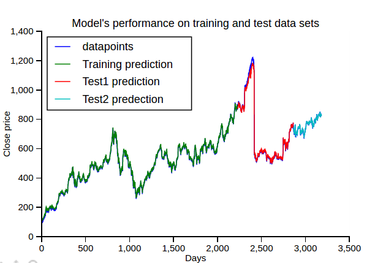

## Projects
### **Predicting Stock prices using Deep learning (Apr 2017 Apr 2017)**

- Description:
Evaluated the performance of LSTM network to predict Google close stock price. Addressed the issue of vanishing gradient in long-term sequences using long short term memory architecture, and developed a model to predict the stock price, approximates the actual value.
